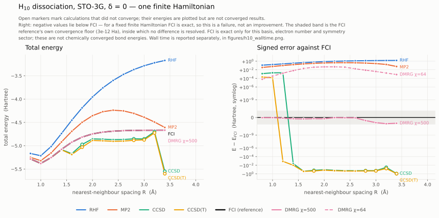
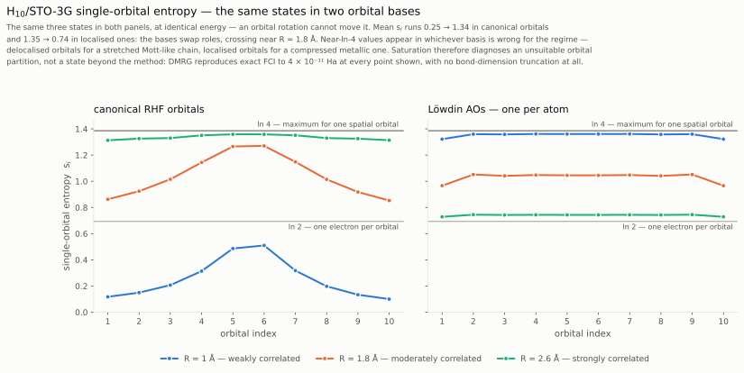
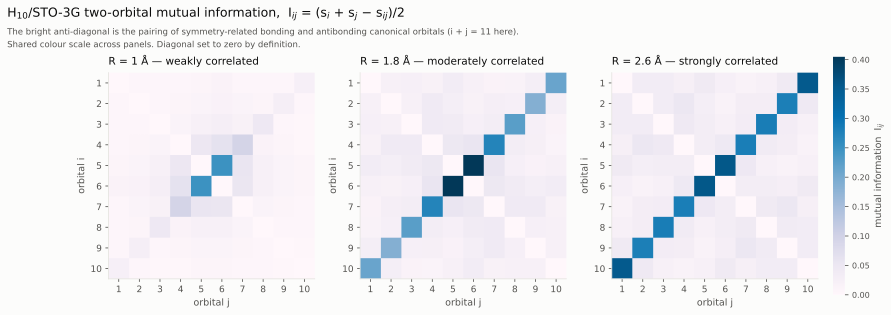
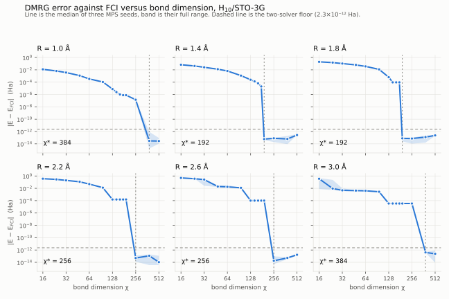
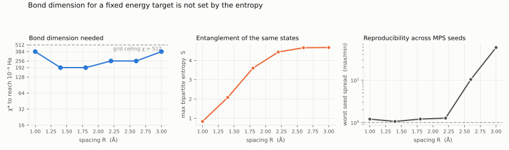
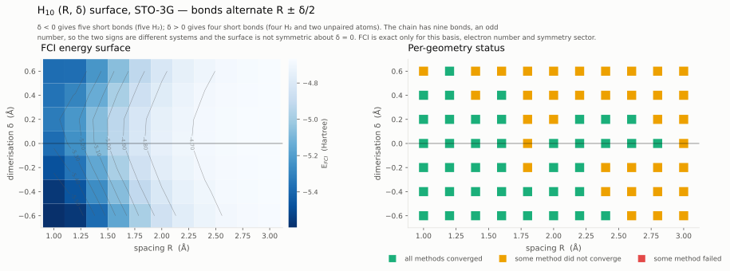
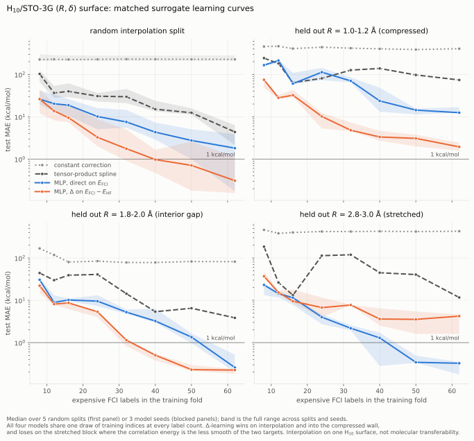

# Tensor networks and molecular electronic structure

A small, reproducible workflow connecting tensor-network methods to molecular
electronic structure: DMRG validated against full configuration interaction on
identical finite Hamiltonians, a strongly correlated hydrogen-chain benchmark,
orbital-entanglement diagnostics, and energy surrogates trained on the resulting
data.

Everything here is a calculation on a deliberately small model. FCI is exact for
the stated basis, electron number and symmetry sector and for nothing else; no
number in this repository is a chemically converged prediction. What the project
demonstrates is solver validation, convention discipline and a controlled
machine-learning comparison — not chemical accuracy.

**Contents.** Independent FCI/DMRG validation · reproduction of a published
hydrogen-chain benchmark · the H₁₀ dissociation curve and coupled-cluster
breakdown · single-orbital entropy and mutual information · symmetry-resolved
MPS structure · a two-dimensional `(R, δ)` dataset · matched direct and
Δ-learning surrogates · an N₂ vignette covering references, active spaces and
basis-set effects.

Longer discussion lives in [`docs/methods-and-limitations.md`](docs/methods-and-limitations.md),
and the prior-art map in [`docs/literature-review.md`](docs/literature-review.md).

## Solver validation

Independent solver validation on identical finite Hamiltonians — the gate that
every later DMRG result depends on:

| System | Basis | Space | E<sub>FCI</sub> (Ha) | \|E<sub>DMRG</sub> − E<sub>FCI</sub>\| |
| --- | --- | --- | --- | --- |
| N₂ at 1.1 Å | STO-3G | 10 orbitals, 14 electrons | −107.654122447525 | 1.7 × 10⁻¹³ Ha |
| H₁₀ at R = 1.0 Å | STO-3G | 10 orbitals, 10 electrons | −5.379954746083 | 1.1 × 10⁻¹³ Ha |
| H₁₀ at R = 2.4 Å | STO-3G | 10 orbitals, 10 electrons | −4.687113558393 | 2.5 × 10⁻¹³ Ha |

against a target of 10⁻⁸ Ha. Both solvers consume the same `h1e`/`g2e`/`ecore`
arrays, and a SHA-256 digest of those arrays is stored in each result record and
re-checked after the run, so "the same Hamiltonian" is recorded evidence rather
than an assumption.

The gate also certifies the *state*, not only the number. Each validated
geometry carries, from the same solver run:

| Check | N₂ 1.1 Å | H₁₀ R=1.0 Å | H₁₀ R=2.4 Å |
| --- | --- | --- | --- |
| ⟨S²⟩ (target 0) | 4.5 × 10⁻¹⁷ | 1.8 × 10⁻¹⁶ | 1.7 × 10⁻¹⁵ |
| entropy sum rule | 2.2 × 10⁻¹³ | 2.2 × 10⁻¹⁶ | 8.9 × 10⁻¹⁶ |
| Schmidt normalisation | 1.8 × 10⁻¹⁴ | 8.9 × 10⁻¹⁶ | 6.7 × 10⁻¹⁶ |

plus the full `(N, 2S, pg)`-labelled Schmidt spectrum — 800 values per geometry,
452 of them at the central cut. ⟨S²⟩ is a gate condition rather than a
formality: energy agreement does not imply sector purity, because an abelian
`SZ` calculation fixes only S<sub>z</sub> and can converge into a different
total-spin sector while its energy still looks reasonable. The check tracks the
requested sector, giving exactly 2.000000 for a triplet target.

### Converging the reference, not just the solver

The DMRG–FCI discrepancy originally grew smoothly with chain spacing, from
10⁻¹² Ha near equilibrium to 1.8 × 10⁻⁹ Ha at R = 3.4 Å. The *sign* identified
the cause: converged DMRG sat below FCI everywhere, and DMRG is variational for
the same Hamiltonian, so the reference was the quantity above the true ground
state. As H₁₀ dissociates, the M<sub>S</sub> = 0 sector fills with
near-degenerate triplets — at R = 3.4 Å the nearest state to the singlet ground
state is a triplet 4.6 × 10⁻⁵ Ha above it, while the nearest *singlet* is 2.6×
further — and PySCF's Davidson, which diagonalises that whole sector with a
default 12-vector subspace, converges progressively worse. block2 is
SU(2)-adapted and never sees those states.

Raising the FCI Davidson subspace to 30 and tightening both solvers' thresholds
to 10⁻¹⁴ cut the worst-case discrepancy from 1.8 × 10⁻⁹ into the 10⁻¹² range, and
*both* energies moved down — confirming that each had been above the true value
rather than disagreeing with the other. The wider subspace is also faster,
because it converges instead of restarting. Bond dimension was never the
constraint: at R = 3.4 Å, χ = 500, 1000 and 1500 agree to 10⁻¹⁴ with a discarded
weight of 10⁻¹⁸.

### Reproducing a published benchmark

The Simons Collaboration hydrogen-chain benchmark
([Motta et al., Phys. Rev. X 7, 031059 (2017)](https://doi.org/10.1103/PhysRevX.7.031059),
data [CC BY 4.0](https://github.com/simonsfoundation/hydrogen-benchmark-PRX))
publishes RHF, CCSD, CCSD(T), FCI and DMRG energies for the H₁₀ linear chain in
a minimal basis — the same system and nearly the same method ladder run here.
This project reproduces its **FCI energies at all ten published spacings to
better than 5 × 10⁻⁹ Ha**, the resolution limit of their eight printed decimals,
and the values are vendored into `data/reference/` so the regression suite
depends on neither the network nor a third-party repository staying put.

| Method | agreement | tolerance | basis of tolerance |
| --- | --- | --- | --- |
| FCI | 4.9 × 10⁻⁹ | 5 × 10⁻⁸ | 8 published decimals |
| CCSD | 4.5 × 10⁻⁷ | 5 × 10⁻⁶ | 6 published decimals |
| CCSD(T) | 3.0 × 10⁻⁷ | 5 × 10⁻⁶ | 6 published decimals |
| DMRG | 1.9 × 10⁻⁶ | 5 × 10⁻⁶ | 6 published decimals |
| RHF | 2.6 × 10⁻⁶ | 5 × 10⁻⁶ | *empirical, not the printed decimals* |

Three things about that comparison are worth stating, because none were
documented at the source and each could have produced a confident wrong answer:

- **The geometry unit and basis had to be established by reproduction.** The
  repository labels the basis only as `STO` and gives no unit for its spacings.
  They are Bohr and STO-6G: those choices reproduce the published FCI to 10⁻⁹,
  while STO-3G differs by 3.6–6.6 × 10⁻² Ha and reading the spacings as Ångström
  reproduces nothing. Both are pinned by tests rather than left to trust.
- **RHF is printed to ten decimals but reproduces only to ~3 × 10⁻⁶.** Our SCF
  solution is internally stable at every spacing and the discrepancy varies
  smoothly with R, changing sign near 1.7 Bohr — the signature of a slightly
  different converged solution, not an error. FCI cannot see it at all, being
  invariant under orbital rotation. Using the printed decimals as a tolerance
  would assert a precision the published value does not carry.
- **A diverged coupled-cluster energy is not a reproducible quantity.** Past
  R ≈ 3.2 Bohr the published CCSD(T) falls 1.0–1.9 Ha below FCI and ours falls
  0.15 Ha below; repeated runs here differ from each other by ~10⁻² Ha. Once the
  amplitude equations have no physical solution, which unphysical one a code
  reaches depends on its solver and starting guess. Those points are therefore
  excluded from the numerical comparison, and the *failure* is asserted
  instead — which both datasets do reproduce.

### Reproducing a published value

block2's own documentation reports **−107.654122447524415 Ha** for N₂/STO-3G at
1.1 Å. This project obtains **−107.654122447525 Ha**, a discrepancy of
−3.4 × 10⁻¹³ Ha, from an independent PySCF FCI diagonalisation. block2's
published run uses D2h symmetry and this one uses C1, so the agreement also
confirms that the energy does not depend on whether point-group symmetry is
exploited.

The external value is recorded and compared but is deliberately *not* part of
the pass criterion: the gate tests the two solvers against each other, and a
published number can legitimately differ in its last digits.

### What independent validation caught

Two defects that a single-solver workflow would have shipped silently:

1. **PySCF's single-root FCI converged to the wrong state.** In the N₂ M<sub>S</sub>=1
   sector it returns −107.343458537272 — the *third* root — while the true
   sector ground state is the doubly degenerate −107.356943001688 that block2
   finds directly. Davidson follows the state seeded from the lowest-diagonal
   determinant, and `fci.addons.fix_spin_` does not help, because the problem
   is root selection rather than spin contamination: every root there already
   has ⟨S²⟩ = 2. `run_fci` now requests several roots in open-shell sectors and
   takes the lowest.
2. **block2 writes into the `g2e` array it is handed.** Symmetrisation and
   unpacking happen in place, which broke the premise that both solvers see the
   same arrays and invalidated the recorded digest after a run. Worse, the
   roundoff-level perturbation was by itself enough to flip which root the
   single-root FCI solver landed on. `run_dmrg` now passes copies and verifies
   the digest is unchanged afterwards.

Neither would have been visible from a converged-looking energy alone. The
Davidson-subspace work described above is *not* a third item of this kind — it is
ordinary convergence checking, recorded because the settings differ from the
package defaults, not because finding it was notable.

### What this does not show

FCI is exact **only for the stated basis, electron number and symmetry sector**.
A minimal basis such as STO-3G is useful for validating a solver and is not
adequate for chemical accuracy. These numbers validate the DMRG implementation
and the conventions around it; they are not converged bond energies, and no
result here should be read as a chemically accurate prediction.

## H₁₀ dissociation and method failure



Left, total energy; right, signed error against FCI on a symlog scale so the
sign is preserved across twelve orders of magnitude. Open markers are
calculations that did not converge. Vector figures are in `figures/`, the
numbers behind them in `figures/h10_curve.csv`, and cost is kept on separate
axes in `figures/h10_walltime.svg`.

Coupled cluster fails in two distinct ways, both visible:

| R (Å) | HF | MP2 | CCSD | CCSD(T) | DMRG χ=500 |
| --- | --- | --- | --- | --- | --- |
| 1.0 | 1.66e-1 | 5.92e-2 | 1.98e-3 | **1.42e-4** | −2.8e-14 |
| 1.6 | 4.72e-1 | 2.34e-1 | −2.46e-1 | −2.64e-1 | −3.0e-13 |
| 2.8 | 1.30e+0 | 3.65e-1 | −1.81e-1 ‡ | −2.12e-1 ‡ | −6.4e-13 |
| 3.4 | 1.50e+0 | 5.85e-2 | −8.82e-1 ‡ | −9.33e-1 ‡ | −1.7e-12 |

‡ amplitude equations did not converge.

From R ≈ 1.2 Å both CCSD and CCSD(T) fall **below** FCI. For a fixed finite
Hamiltonian FCI is exact, so a lower energy is a failure and not an improvement,
and CCSD(T) is consistently *worse* than CCSD — the triples correction amplifies
the breakdown rather than repairing it. Past R ≈ 2.8 Å the amplitude equations
stop converging as well. MP2's error is non-monotonic through accidental
cancellation, not accuracy.

Two limits of the reference itself are worth stating plainly. FCI is exact only
for this basis, electron number and symmetry sector — these are not chemically
converged bond energies. And the FCI reference is not numerically exact at the
stretched end: DMRG is variational, so where converged DMRG sits below FCI the
*reference* is what has not converged. That floor is 2.3 × 10⁻¹² Ha at its worst
(R = 3.4 Å), and no smaller difference is resolvable there.

On cost, FCI grows steeply across the range (0.7 s → 9.1 s) while DMRG at the
FCI-validated bond dimension stays flatter (4.8 s → 8.1 s), crossing near
R = 3.2 Å.

## Orbital entanglement



Single-orbital entropy `s_i` and two-orbital mutual information
`I_ij = (s_i + s_j − s_ij)/2` at three points on the validated δ = 0 curve —
the standard QC-DMRG diagnostics
([Legeza & Sólyom 2003](https://doi.org/10.1103/PhysRevB.68.195116);
[Rissler, Noack & White 2006](https://doi.org/10.1016/j.chemphys.2005.10.018);
[Boguslawski & Tecmer 2015](https://doi.org/10.1002/qua.24832)). Nothing here is
novel; the point is that the machinery is the same one used throughout this
project, applied to a molecular Hamiltonian.

| R (Å) | regime | Σ s_i | max I_ij |
| --- | --- | --- | --- |
| 1.0 | weakly correlated | 2.53 | 0.248 |
| 1.8 | moderately correlated | 10.42 | 0.405 |
| 2.6 | strongly correlated | 13.36 | 0.357 |

At R = 1.0 Å the entropy is concentrated on the frontier orbitals and near zero
at the extremes — a nearly single-determinant state. By R = 2.6 Å every orbital
sits close to the ln 4 ceiling (Σ s_i = 13.36 against a maximum of 13.86): no
orbital is idle, which is what strong correlation looks like in this diagnostic.



The mutual information is dominated by a bright anti-diagonal, `i + j = 11`:
the pairing of symmetry-related bonding and antibonding canonical orbitals.

### The near-ceiling values are a property of the basis

At R = 2.6 Å the canonical `s_i` sits within a few percent of its ln 4 ceiling,
which invites the reading that the state is so correlated the calculation must
be losing accuracy. It is not, and the second panel of the figure shows why.

Localising the orbitals (symmetric Löwdin orthogonalisation, one orbital per
atom) is a unitary change of basis, so the FCI energy is unchanged to 10⁻¹⁰ —
but `s_i` changes completely, and **the two bases swap roles across the curve**:

| R (Å) | mean s_i, canonical | mean s_i, Löwdin |
| --- | --- | --- |
| 1.0 | **0.253** | 1.352 |
| 1.8 | 1.042 | 1.030 |
| 2.6 | 1.336 | **0.741** |

Near-ln-4 values appear in whichever basis is *wrong* for the regime:
delocalised orbitals for a stretched Mott-like chain, localised orbitals for a
compressed metallic one. At R = 2.6 Å the localised picture is one electron per
atom (⟨n_i⟩ = 1.000000, spread 7 × 10⁻⁶) with s_i between 0.728 and 0.745,
just above ln 2 — the Mott signature, nowhere near saturated. A saturated `s_i`
therefore diagnoses an unsuitable orbital partition, not a state beyond the
reach of the method.

Three further points close the accuracy question for these calculations:

- **Nothing is truncated.** At the central cut the reduced Schmidt rank is 452
  against a bond dimension of 500, so the MPS is an exact representation, and
  DMRG reproduces FCI to 7 × 10⁻¹⁴ Ha there. FCI is exact diagonalisation of
  this Hamiltonian — no higher-order many-body effect is omitted.
- **The bipartite entanglement is not saturated.** At the central cut it is
  67.5% of its ceiling, against 94.7% at the outermost cut. Single-orbital
  entropy looks saturated because its ceiling is small (ln 4), not because the
  state is maximally entangled.
- **Σ s_i is an upper bound, not a measure.** It multiply-counts correlation
  shared between orbitals: Σ s_i = 13.36 while the actual bipartite entanglement
  at the central cut is 4.66.

**These are not invariants of the molecule.** `s_i` and `I_ij` describe
entanglement between the *chosen* orbitals. Both bases are reported for exactly
this reason; the canonical values use RHF orbitals, no frozen core, in PySCF's
ordering.

### Two routes, because one of them is broken

`DMRGDriver.get_orbital_entropies` **raises in SU2 mode** in block2 0.5.4rc16 and
works in SZ, so the two quantities come from different calculations:

- `s_i` analytically from the spin-traced 1- and 2-RDM of the validated SU2 run.
  Exact for a spin-adapted singlet, since spin symmetry fixes
  ⟨n<sub>i↑</sub>⟩ = ⟨n<sub>i↓</sub>⟩ = ⟨n<sub>i</sub>⟩/2 and the double occupancy is
  `dm2[i,i,i,i]/2`.
- `s_ij` from an SZ calculation through block2's own routine.

The SZ state is verified before its numbers are used — energy against SU2,
⟨S²⟩ against the target sector, and `s_i` against the analytic route — because
an SZ MPS fixes only S<sub>z</sub> and can converge into the wrong total-spin
sector while its energy still looks right. Agreement across the three
geometries: energies to 8.7 × 10⁻¹² Ha, ⟨S²⟩ below 7.7 × 10⁻⁹, and `s_i` to
8.0 × 10⁻⁷. The overlap on `s_i` is what makes this a check rather than two
guesses; `compute_orbital_entanglement` raises rather than record entanglement
for a state that is not the validated one.

All reduced-density-matrix invariants hold exactly across all three geometries
(**worst violation 0.0**): trace of the 1-RDM, Hermiticity, natural occupations
inside [0, 2], `tr` of the 2-RDM equal to N(N−1), one-orbital probabilities
normalised and non-negative, and both subadditivity and the Araki–Lieb
inequality satisfied.

## Symmetry-resolved MPS structure

DMRG runs in a symmetry-adapted basis, so every virtual bond of the converged
MPS carries a definite `(N, 2S, pg)` label and the Schmidt spectrum is block
diagonal in it. That structure is extracted and stored — it costs nothing beyond
the run already performed, and cannot be recovered later without re-running the
solver. About 800 Schmidt values per H₁₀ geometry.

The von Neumann entanglement decomposes exactly into a charge part and the
entanglement remaining once the charge is known:

```text
S(l) = S_number(l) + Σ_N p[l,N] · S_N(l)
```

This holds to 10⁻¹⁶, and is the strongest invariant in the codebase: its three
terms come from the pooled spectrum, the charge marginal and the per-charge
spectra, so none can be wrong in isolation while it holds. It also separates two
effects a single entropy conflates — at the central cut of H₁₀, stretching from
R = 1.0 Å to 2.4 Å multiplies the number entropy by 3.2 (0.494 → 1.606) but the
configurational part by 8.7 (0.344 → 2.988), as entanglement moves inside fixed
charge sectors.

Two findings from building this:

- **block2's `get_bipartite_entanglement` under-reports SU(2) entanglement.** It
  takes the Shannon entropy of the reduced multiplet spectrum, counting each
  multiplet once instead of `2S+1` times. At the central cut of H₁₀ at R = 2.4 Å
  it returns 4.46886 where the true von Neumann entropy is 4.59414. An
  independent abelian `SZ` calculation of the same state settles which is right.
- **Low-bond-dimension runs are not a smooth function of the geometry.** In the
  stored profiles the χ = 32 error against FCI runs 3.6 × 10⁻³, 2.6 × 10⁻²,
  9.5 × 10⁻², 1.9 × 10⁻¹, 2.0 × 10⁻², 8.5 × 10⁻³ Ha across R = 1.0 to 3.0 Å —
  jumping an order of magnitude between adjacent spacings, and *falling* where
  the physics gets harder, because DMRG lands in whichever local minimum the
  sweeps reach. At χ = 500 the same errors are ~10⁻¹³ Ha. The seed dependence
  behind this is measured systematically in the next section. A low-fidelity tier
  has to be checked for seed and geometry stability before anything is learned
  from it; this one does not pass, and it is therefore not used as a fidelity
  tier anywhere in this repository.

## Bond dimension and cost

χ ∈ {16 … 512} at six spacings, three MPS seeds each, scored against the FCI
reference for the same integrals. `χ*` is the smallest sampled bond dimension
reaching 10⁻⁹ Ha — three orders of magnitude above the reference floor, so it
measures the MPS rather than the last digits of the comparison.



| R (Å) | max bipartite S | χ* to 10⁻⁹ Ha | worst seed spread |
| --- | --- | --- | --- |
| 1.0 | 0.84 | 384 | 1.2× |
| 1.4 | 2.08 | 192 | 1.1× |
| 1.8 | 3.60 | 192 | 1.2× |
| 2.2 | 4.44 | 256 | 1.3× |
| 2.6 | 4.66 | 256 | 10.3× |
| 3.0 | 4.67 | 384 | 58.7× |

Every spacing reaches the reference floor by χ = 384; the worst case, R = 3.0 Å,
lands at 1.1 × 10⁻¹² against a floor of 2.3 × 10⁻¹². At χ = 512 the MPS carries
992 states at the central cut — exactly the full Schmidt rank there, since the
452 SU(2) multiplets counted with their 2S+1 degeneracies give 992 — so DMRG is
exact by construction at that point rather than merely converged.



- **Entropy predicts representational cost, not energetic cost.** From the exact
  Schmidt spectrum, the number of states needed for a fixed *truncation* error
  tracks the entropy just as the standard argument says (Pearson ρ of ln n with S
  is +0.85 at a discarded weight of 10⁻⁶, +0.86 at 10⁻⁹). Against χ*, which is
  defined by a fixed *energy* accuracy, ρ = −0.08, and χ* is U-shaped while the
  entropy is monotone. Rényi orders ½, 2 and ∞ behave the same, so this is not
  the wrong entropy. What differs is the conversion: at a common χ = 128 the
  energy error per unit of discarded weight falls from 0.109 at R = 1.0 Å to
  8.2 × 10⁻⁴ at R = 3.0 Å, a factor of 133 — discarding a given Schmidt weight
  costs far more energy at the compressed end, where the tail is not
  spin-degenerate. Entropy is a guide to representing the *state*, not to the
  bond dimension a target *energy* needs.
- **The error moves in plateaus, not a smooth decay.** At R = 2.2 Å the energy is
  constant to ~10⁻¹³ from χ = 128 to 192 and then jumps by 1.5 × 10⁻⁴; at
  R = 3.0 Å the plateau runs from χ = 128 all the way to 256 and only breaks at
  384. Meanwhile the discarded weight falls smoothly and the entropy rises, so
  the added bond dimension is going into directions that carry entropy but no
  energy. A convergence check comparing two neighbouring bond dimensions inside
  one of these plateaus would report agreement while sitting 10⁻⁴ Ha away.
- **Low-χ runs are reproducible except at the stretched end.** Seeds agree to
  within 1.3× out to R = 2.2 Å; the spread appears only at R = 2.6 (10.3×) and
  R = 3.0 (58.7×). This is measured above the reference floor only — below it,
  seed ratios are large but meaningless.
- **Discarded weight is not an error bar across geometries.** The familiar
  proportionality holds within one geometry (at R = 1.0 Å the ratio of error to
  discarded weight is 0.11, 0.057, 0.055 across χ = 128, 192, 256) and fails
  between them: a converged run at R = 1.8 Å reports a discarded weight larger
  than that of a far worse run elsewhere.
- **A singular-value cutoff does not reduce cost, but it separates static from
  dynamic correlation.** `DMRGSchedule` carries one, so the kept basis is set by
  whichever of the cutoff and the bond dimension binds first. At 1e-14 it does
  not bind at χ ≥ 384 — identical bond dimensions with and without it at every
  spacing — so reaching the floor is the bond dimension's doing, and no cutoff
  gave a systematic wall-time saving. Loosened to 1e-8 against a χ = 512 cap it
  finally bites, and asymmetrically: at R = 1.0 Å only 708 of 992 states survive
  and the error jumps to 5.0 × 10⁻⁷, while at R ≥ 1.8 Å at least 980 survive and
  the error stays at ~10⁻¹³. The compressed geometry assembles its correlation
  energy from many individually negligible Schmidt weights; the stretched ones
  carry theirs in a few large ones. That is why the least-entangled geometry is
  among the most expensive.

The condensed-matter expectation that the variational energy gradient falls off
smoothly with bond dimension describes the compressed end of this curve and not
the stretched end, where the state is a superposition of a small number of
near-degenerate spin configurations and the energy only moves once χ crosses the
threshold at which that set becomes representable.

Numbers behind the figures are in `figures/h10_chi_convergence.csv`.

### A longer chain does not make the tensor network pay off

The usual argument is that DMRG's advantage appears with length — the
determinant count explodes while the bond dimension needed does not. Measured
(`scripts/chain_length_scaling.py`), it does not appear here. Exact
diagonalisation does run out first, as expected: with 61 GB, one FCI Davidson
vector is 1.3 GB at H₁₆ and 18.9 GB at H₁₈, so from H₁₈ upward DMRG is the only
exact method left. But at H₁₂ and R = 3.0 Å, against an FCI reference costing
44 s, DMRG plateaus at 2.5–4.2 × 10⁻³ Ha and stays there: 366 s at a bond cap of
512, and unchanged at 14, 30 or 60 sweeps. The energy surrogate's own test MAE is
4 × 10⁻⁴ Ha, so the labels would be ten times worse than the model trained on
them.

At a cap of 256 the discarded weight reads 3.3 × 10⁻⁷ — below the requested
cutoff, so every automatic indicator calls the run converged — while the energy
is 4.2 × 10⁻³ Ha wrong. Past H₁₆ there is no reference left to catch that.

Hₙ in STO-3G is n orbitals and n electrons: a minimal basis at half filling, with
maximal entanglement per site and no weakly-correlated orbitals to compress. That
is close to the least favourable shape for DMRG against exact diagonalisation,
and lengthening the chain moves along it rather than out of it.

## The (R, δ) surface



An 11 × 7 grid over nearest-neighbour spacing `R` and alternating displacement
`δ`: **77 geometries × 7 methods = 539 records**. FCI converged at every
geometry. The 36 geometries carrying an unconverged coupled-cluster result keep
those rows with their status, and the right panel maps where they fall — a
dataset is ready for a learning study when the failures are located, not when
the row count looks right.

`δ` spans both signs deliberately. H₁₀ has ten atoms and therefore *nine* bonds,
an odd number, so `+δ` and `−δ` are different systems: `δ < 0` gives five H₂
molecules, `δ > 0` four H₂ plus two unpaired terminal atoms, and the two differ
by 210 mHa at R = 1.0 Å. The symmetry that would excuse sampling one sign holds
for rings and for chains with an even bond count, not here.

## Energy surrogates



Four models fitted to the same expensive labels, on the same splits, with the
same preprocessing: a constant correction `E_HF + mean(E_FCI − E_HF)`, a
tensor-product cubic B-spline, a small JAX MLP trained on `E_FCI`, and the same
architecture trained on `E_FCI − E_HF` with HF restored at inference. The two
neural models differ *only* in the target.

Normalisation is fitted on the training fold alone, the same training indices
are handed to all four models at every label count, and results cover three
model seeds. Blocked holdouts are drawn on `R` rather than `δ`, because the
coupled-cluster failures cluster at `δ > 0`. The 80,000-step training budget was
set by measurement: at 4,000 steps both neural models are still under-trained,
and the comparison between them would have measured the optimiser instead.

Median test MAE at 62 labels (kcal/mol):

| split | constant | spline | MLP direct | MLP Δ |
| --- | --- | --- | --- | --- |
| random interpolation | 226.8 | 4.37 | 1.81 | **0.31** |
| held out R = 1.0–1.2 Å | 405.9 | 74.07 | 12.76 | **1.96** |
| held out R = 1.8–2.0 Å | 81.8 | 3.85 | 0.25 | 0.23 |
| held out R = 2.8–3.0 Å | 429.4 | 11.65 | **0.32** | 4.29 |

**Δ-learning helps, conditionally, and the condition is physical.** It wins by
about 6× on random interpolation and into the compressed wall, ties in the
interior gap, and *loses* by 13× on the stretched block. The mechanism is
measurable rather than a story: the correlation energy carries about half the
curvature of the total energy per unit of its own range in the compressed and
middle regions (ratios 0.50 and 0.46) and **2.8× more** in the stretched region,
where `E_FCI` flattens toward dissociation while `E_corr` is still changing
rapidly. Δ-learning helps where the baseline's error is the smoother of the two
targets, and not otherwise. It is not simply a smaller target: the Δ surface
spans 833 kcal/mol against the total energy's 583.

Derivatives with respect to `(R, δ)` come from `-jax.grad(E)` and agree with
central differences of the same fitted model to 3.1 × 10⁻⁶ relative. These are
two-component generalized-coordinate derivatives of a *fitted surface* — not
Cartesian atomic forces, and not evidence about the underlying physics. No model
here was trained on force labels. Interpolating one H₁₀ surface is also not
transferability to other molecules, and is not described as such.

Cost context: the FCI labels for the whole grid cost 214 s (2.8 s per point),
the HF baseline 5.4 s, and warm inference is sub-millisecond.

### Entanglement does not predict where the surrogate fails

The surrogate is trained on geometry alone, so the obvious way to make the
tensor-network diagnostics load-bearing is to have them flag untrustworthy
predictions. Tested directly: each surrogate fitted at its largest budget on all
eight splits with three seeds, per-geometry held-out error ranked against each
candidate signal, correlations taken within a split before pooling. Pooled
Spearman ρ against |error| over 117 held-out points:

| signal | direct | Δ | direct, R controlled | Δ, R controlled |
| --- | --- | --- | --- | --- |
| max bipartite entropy | −0.596 | 0.098 | −0.287 | 0.146 |
| configurational entropy | −0.598 | 0.096 | −0.364 | 0.112 |
| **ensemble disagreement** *(free)* | **0.760** | **0.622** | **0.526** | **0.599** |
| distance to training set *(free)* | 0.340 | 0.460 | — | — |
| spacing R *(free)* | −0.510 | 0.120 | — | — |

Disagreement between model seeds — already computed, so free — is the strongest
signal for both models. About half of the entanglement correlation is the
spacing R, which the model already consumes, and for Δ-learning, the model that
actually fails on the stretched block, the entanglement signal is ≈ 0.10. The
residual even changes sign between the two models, so it tracks the validity of
the RHF *baseline* rather than the trustworthiness of the surrogate. The cheap
χ = 64 tier gives the same answer.

Reported as a negative result. It also fixes the cost picture: converged DMRG
costs 5.4 s here against FCI's 2.4 s, so on this system the diagnostic is more
expensive than the label it would be triaging.

## N₂: a chemistry-facing vignette

H₁₀/STO-3G hides every choice a practising computational chemist makes — there
is one sensible basis, no core to freeze, no active space to select. N₂ at three
bond lengths in two bases puts those choices back. Error against FCI in STO-3G,
in kcal/mol:

| method | 1.098 Å | 1.6 Å | 2.4 Å |
| --- | --- | --- | --- |
| RHF | 98.5 | 224.2 | 492.4 |
| UHF | 98.5 | 60.8 | 2.7 |
| MP2 | 2.0 | −63.6 | −445.4 |
| CCSD(T) | 1.6 | 6.2 | 252.5 ‡ |
| CASSCF(10e,8o) | 0.08 | 0.02 | 0.001 |
| NEVPT2/CASSCF | 0.001 | 0.000 | 0.000 |

‡ amplitude equations did not converge. Negative means below FCI, which for a
fixed finite Hamiltonian is a failure rather than an improvement.

- **RHF stops being a minimum.** Its internal stability analysis passes at
  equilibrium and fails at both stretched geometries. The stabilised UHF
  solution is 2.7 kcal/mol from FCI at 2.4 Å — but carries ⟨S²⟩ = 2.96 for a
  nominal singlet. The energy looks good because the state is wrong.
- **MP2 diverges** where the reference does, landing 445 kcal/mol below FCI while
  reporting no convergence failure of its own — it has no iterations to fail.
- **In a minimal basis, CAS(10e,8o) *is* frozen-core FCI.** N₂/STO-3G has ten
  orbitals, so leaving the two 1s inactive leaves nothing outside the active
  space. That is why the NEVPT2 correction is ~10⁻⁴ Ha here and why
  CASSCF+NEVPT2 reproduces all-electron FCI to 10⁻⁶ Ha.
- **cc-pVDZ is where external correlation becomes visible.** The same NEVPT2
  correction is ~150 mHa (~94 kcal/mol), and the method ordering reverses along
  the stretch: CCSD(T) is the better number at equilibrium, while at 2.4 Å it has
  diverged and the multireference treatment has not.

Full numbers, including cc-pVDZ, active-space natural occupations and ⟨S²⟩, are
in `figures/n2_vignette.csv`.

## N₂ past the exact-diagonalisation wall

The vignette above stops where CASSCF does. This section continues the same
molecule upward through active spaces that exact diagonalisation cannot reach,
which is the regime production QC-DMRG is actually used in — a standard
application of the method, not a new one.

Freezing the two N 1s cores in cc-pVDZ leaves 26 orbitals for 10 valence
electrons, with a determinant ladder underneath:

| active space | determinants | exact diagonalisation |
| --- | --- | --- |
| CAS(10e, 8o) | 3,136 | trivial — the vignette's space |
| CAS(10e,12o) | 627,264 | easy |
| CAS(10e,16o) | 19,079,424 | feasible |
| CAS(10e,20o) | 240,374,016 | out of reach here |
| CAS(10e,26o) | 4,327,008,400 | out of reach — *frozen-core FCI* |
| CAS(14e,28o) | 1,401,950,721,600 | out of reach — *full CI* |

DMRG spans the whole range, so there is an **overlap region** where it must
reproduce an exact answer and a **DMRG-only region** above it, on the same
molecule, basis and orbitals. That structure is what makes the upper rungs
checkable at all; the hydrogen chains never had it.

### Below the wall: what it costs to reproduce the exact answer

χ\* is the smallest bond dimension whose energy is within 10⁻⁹ Ha of exact
diagonalisation in the same active space, worst of the seeds tried. Wall times
were measured under mild load and are indicative, not benchmarks.

| CAS | dets | χ\* canonical | χ\* Fiedler |
| --- | --- | --- | --- |
| (10e, 8o) | 3,136 | 250 | 250 |
| (10e,12o) | 627,264 | 1000 | **250** |
| (10e,16o) | 19,079,424 | not reached at χ ≤ 1000 | 1000 |

`CASCI(10e,8o)` computed through this path reproduces the vignette's stored
energies exactly, and both solvers consume one integral array whose SHA-256
digest is recorded, so "the same Hamiltonian" is evidence rather than an
assumption.

**Orbital ordering is the variable that matters.** Mutual-information ordering
is standard in production DMRG codes and is implemented in `block2`; what is
measured here is its size on this system. At 12 orbitals it cuts the required
bond dimension fourfold; at 16 the canonical (orbital-energy) ordering does not
reach 10⁻⁹ Ha anywhere on the grid while the Fiedler ordering does.

### A local minimum that every cheap diagnostic called converged

Worth reporting because it is a negative result about *this project's own
protocol*, found in the last active space that still had a reference to find it
with.

In `CAS(10e,16o)` with Fiedler ordering, an earlier sweep schedule converged to
a state **0.19 Ha (5 eV) above the ground state** — at every bond dimension and
both seeds at 1.6 Å — while reporting a final discarded weight of 5 × 10⁻¹⁰. At
2.4 Å it was worse than wrong: χ = 500 found the right state, χ = 1000 at the
same seed found the wrong one, and χ = 1000 at a different seed found the right
one again. More variational freedom gave a worse answer.

Three controls separated the causes. Exact diagonalisation of the *reordered*
integrals matched the canonical value to 2.8 × 10⁻¹⁴, so the Hamiltonian was
never at fault. The same seed and χ converged correctly under a flat schedule,
so the ordering was not at fault. A schedule whose noise extended into the
full-χ sweeps also converged, which named the cause: the ramp spent its entire
perturbative-noise budget while χ was a sixteenth of its target, then reached
full bond dimension with the noise already at zero.

**None of the diagnostics available without an exact reference detected it.**
The discarded weight read 5 × 10⁻¹⁰; the seeds agreed with each other to
10⁻¹²; and the wrong state's entanglement was *lower* than the right one's at
one geometry and *higher* at another. The only signal that worked was running
two orbital orderings and noticing they disagreed by 0.19 Ha.

The schedule is fixed, and three invariants in `tests/test_conventions.py` now
assert that every schedule carries noise at at least half its own peak bond
dimension, ends noise-free so the reported energy is variational, and specifies
all of its own sweeps rather than relying on backend padding. The records from
the defective runs are kept rather than deleted.

### Above the wall: full CI in cc-pVDZ

No exact diagonalisation is possible at these rungs, so **nothing in the table
below is an error against an answer this project computed**. DMRG is variational,
so the lowest energy found bounds the answer from above; the uncertainty quoted
is the largest of the final χ step, the disagreement between the two orbital
orderings, the seed spread and the residual sweep-to-sweep drift. It bounds the
spread of what was tried, which is a weaker claim than an error bar and is the
honest one.

That uncertainty recipe is itself testable against the literature, and
[An external check above the wall](#an-external-check-above-the-wall) does it.
The short version: at the three geometries where a published near-exact value can
be brought to bear, the true error falls inside the band every time, and the band
over-covers by a factor of three.

| R (Å) | rung | what it is | E<sub>DMRG</sub> (Ha) | uncertainty (Ha) |
| --- | --- | --- | --- | --- |
| 1.098 | (10e,26o) | frozen-core FCI | −109.276880996 | 5.4 × 10⁻⁴ |
| 1.098 | (14e,28o) | **full CI** | −109.280658327 | 7.3 × 10⁻⁴ |
| 1.600 | (10e,26o) | frozen-core FCI | −109.080718233 | 1.2 × 10⁻³ |
| 1.600 | (14e,28o) | **full CI** | −109.083789143 | 1.5 × 10⁻³ |
| 2.400 | (10e,26o) | frozen-core FCI | −108.962169921 | 1.1 × 10⁻³ |
| 2.400 | (14e,28o) | **full CI** | −108.965255267 | 1.4 × 10⁻³ |

The ordering gap dominates the uncertainty at every point, which is the intended
design after the failure above.

### What the valence active space misses, measured rather than estimated

The vignette computes NEVPT2 on `CASSCF(10e,8o)`, a *perturbative* estimate of
the correlation lying outside that space. The 28-orbital rung measures the same
quantity *variationally*. The comparison is made against `CAS(14e,28o)` and not
the frozen-core rung, because PySCF's NEVPT2 excites out of the CASSCF core and
therefore carries core correlation the frozen-core space does not — a 3–4 mHa
difference, larger than the agreement being discussed.

| R (Å) | NEVPT2 correction | variational (26o − CASSCF) | NEVPT2 − full CI | kcal/mol | recovered |
| --- | --- | --- | --- | --- | --- |
| 1.098 | −0.146323 | −0.174230 | +0.031684 | 19.9 | 82.2% |
| 1.600 | −0.155883 | −0.184996 | +0.032184 | 20.2 | 82.9% |
| 2.400 | −0.150373 | −0.183127 | +0.035839 | 22.5 | 80.8% |

**NEVPT2 recovers 81–83% of the correlation outside `CAS(10e,8o)` and misses
about 20 kcal/mol at every geometry.** The vignette had argued from natural
occupations that the valence space was adequate at 2.4 Å; this measures what the
truncation costs instead of asserting it.

**On whether that error worsens toward dissociation, only the last step is
resolved.** From 1.098 Å to 1.600 Å the error moves by 0.5 mHa against a 1.5 mHa
uncertainty, so those two are indistinguishable. From 1.600 Å to 2.400 Å it
moves by 3.7 mHa, about 2.5× the uncertainty. The supportable statement is that
the error is flat from equilibrium to 1.6 Å and rises modestly at 2.4 Å — not
that it degrades smoothly with bond length.

### Two independent cross-checks

**Core correlation, two ways.** `E(14e,28o) − E(10e,26o)` isolates it directly:
−3.78, −3.07 and −3.09 mHa. Estimated separately from frozen-core against
all-electron CCSD(T) in the same basis: −3.89 and −3.15 mHa at the two
geometries where CCSD(T) still converges. Two unrelated routes agreeing to
~0.1 mHa is the strongest available evidence that the active-space bookkeeping
is right.

**CCSD(T) against full CI in the same basis**, measurable here for the first time
in this repository: +1.5 mHa at equilibrium, +7.4 mHa at 1.6 Å and **+265 mHa**
at 2.4 Å. The vignette showed CCSD(T) failing at the stretched geometry; this
puts a number on it.

### An external check above the wall

Everything above compares the ladder to numbers this project produced. Above
sixteen orbitals that stops being possible, which leaves the uncertainty recipe
resting on itself. Three published near-exact values fix that. All three were
verified against their DOI or arXiv record and are vendored in
`data/reference/n2_ccpvdz_external.json` with the tests that check them.

| source | space | geometry | value (Ha) |
| --- | --- | --- | --- |
| CDFCI — Wang, Li & Lu, *JCTC* (2019) | all-electron (14e,28o) | 2.118 a₀ | −109.2821727 |
| DMRG — Chan, Kállay & Gauss, *JCP* **121**, 6110 (2004) | all-electron (14e,28o) | 2.118 a₀ | −109.282157 |
| SHCI — Sharma *et al.*, *JCTC* (2017) | frozen-core (10e,26o) | 1.0977 Å | −109.2769(1) |

CDFCI and Chan's DMRG are independent methods agreeing to 1.6 × 10⁻⁵ Ha, so the
all-electron reference is known 37–73× better than the uncertainties it is used
to test (39× at the geometry actually run here) — sharp enough to test them
rather than merely agree with them.

**The conventions were checked before the energies.** Our RHF at 2.118 a₀
reproduces the published −108.9493779 to 2.1 × 10⁻⁸ Ha, which is that value's own
rounding. That single number fixes basis, geometry, unit and — the one that could
have silently invalidated everything — spherical against Cartesian d functions.
cc-pVDZ with Cartesian d gives 30 orbitals rather than 28, converges happily, and
looks identical in a log file. Both are locked by tests.

Two details that decide whether these values are usable at all:

- **The sources use different units.** 2.118 is Bohr and 1.0977 is Ångström.
  They are two geometries 0.023 Å apart, not one geometry twice.
- **Neither is on this project's grid.** So the all-electron comparison was made
  by *running the ladder at their bond length* — eight DMRG runs, 16.4 h wall,
  its own store. CDFCI also publishes its whole curve on a 0.05 a₀ grid near
  equilibrium, which interpolates onto two geometries already computed here at no
  cost. 2.4 Å = 4.535 a₀ is past the curve's last point and is **refused**, not
  extrapolated to: an extrapolated reference would be this project's own
  smoothness assumption wearing someone else's citation.

| R | how | ours (Ha) | published (Ha) | ours − published | σ | σ / \|err\| | gap / \|err\| |
| --- | --- | --- | --- | --- | --- | --- | --- |
| 2.118 a₀ | run for this | −109.281909 | −109.282173 | +2.64 × 10⁻⁴ | 7.9 × 10⁻⁴ | 2.98× | 1.03× |
| 1.098 Å | published curve | −109.280658 | −109.280913 | +2.54 × 10⁻⁴ | 7.3 × 10⁻⁴ | 2.87× | 1.05× |
| 1.600 Å | published curve | −109.083789 | −109.084270 | +4.81 × 10⁻⁴ | 1.5 × 10⁻³ | 3.02× | 0.68× |
| 2.400 Å | — | −108.965255 | — | — | 1.4 × 10⁻³ | — | — |

**The uncertainty is honest, and loose by a consistent factor of three.** Every
comparison falls inside the quoted band, every DMRG energy sits *above* the
published one as a variational bound must, and σ / \|error\| is 2.87×, 2.98× and
3.02× — a 5% spread across three geometries and two independent routes to the
reference. The χ step dominates the band in all three.

**The ordering gap alone is the right size for the error, and is still not a
bound.** Taken by itself it gives 1.05×, 1.03× and 0.68× the true error: at two
geometries it predicts the error to within 5%, and at 1.600 Å it *under*-estimates
it by half again. So the diagnostic this project trusts most — the only one that
ever caught a converged-looking wrong answer — is also the best-calibrated
magnitude estimate, and for exactly that reason must not be quoted as an error bar
on its own. Taking the maximum over the four terms is what makes the band a bound.

The frozen-core rung agrees with SHCI to 1.9 × 10⁻⁵ Ha, but that comparison
crosses a 0.0003 Å geometry offset worth 3.5 × 10⁻⁵ Ha by CCSD(T). The agreement
is smaller than the offset separating it, so the supportable statement is that the
rung agrees to better than the offset — not that it agrees to 1.9 × 10⁻⁵.

Interpolation error is measured rather than assumed: leave-one-out cubic-spline
prediction of each interior published point is accurate to ~1.0 × 10⁻⁵ Ha near
both geometries used here, and 6.2 × 10⁻⁵ at worst across the curve. It is
conservative by construction, since dropping a point doubles the local grid
spacing. That measured error is folded into the reference's uncertainty.

### What this does and does not show

**Does:** that the tensor network computes something on a real molecule in a
real basis that exact diagonalisation here cannot, validated against an exact
answer wherever both run, and used to quantify a perturbative correction the
rest of this repository relies on.

**Does not:** anything about the physical N₂ molecule. cc-pVDZ is not
basis-converged, so the 20 kcal/mol figure is a statement about correlation
treatment at a fixed basis, not about chemistry. The published values used below
are near-exact, not exact, and the most strongly multireference geometry here —
2.4 Å — lies outside the published curve and is **not** externally checked. And
three bond lengths are not a surface: **no model was trained on any of this data,
and no machine-learning claim is made from it.**

Numbers are in `figures/n2_ladder.csv`, `figures/n2_outside_correlation.csv` and
`figures/n2_external_check.csv`.

## Environment

Dependencies are resolved and locked with [uv](https://docs.astral.sh/uv/).
`.python-version`, `pyproject.toml` and `uv.lock` are committed, so the
published calculations are reproducible from the lockfile.

- **Resolution date:** 2026-09-02
- **Python:** 3.14.7 (`requires-python = ">=3.14"`)
- **uv:** 0.12.8

Direct dependencies as resolved:

| Package | Version | Role |
| --- | --- | --- |
| `pyscf` | 2.14.0 | molecular integrals, SCF, MP2, CC, FCI, CASSCF, NEVPT2 |
| `block2` | 0.5.4rc16 | DMRG (from the block2-preview index) |
| `jax` | 0.11.1 | energy surrogates and autodiff derivatives |
| `tblite` | 0.7.0 | GFN2-xTB semiempirical smoke test |
| `quimb` | 1.15.0 | tensor-network utilities |
| `mkl` | 2024.2.2 | block2 runtime dependency |
| `mkl-include` | 2026.1.0 | block2 runtime dependency |
| `intel-openmp` | 2026.1.1 | block2 runtime dependency |

`block2` is installed from the
[block2-preview](https://block-hczhai.github.io/block2-preview/pypi/) index,
declared in `pyproject.toml`; it provides the current binary wheels.

### DMRG fallback status

`pyblock3` was probed as a fallback DMRG backend and **is not usable here**.
It publishes no wheel for Python 3.14, and its preview cp313 wheel bundles an
incomplete Intel MKL: `libmkl_def.so.1` is missing from `pyblock3.libs/`, and
MKL resolves that file by absolute path inside the wheel's own directory, so it
cannot be supplied externally. The MPO build dies with a native MKL fatal
error. The probe, the workarounds attempted and the reference energy it was
checked against are recorded in `data/raw/smoke/pyblock3_probe.json`.

This is a recorded negative result, not an obstacle: `block2` works, and the
project depends only on it.

## Reproducing

```bash
uv sync                                        # create the locked environment

uv run python scripts/smoke_test.py            # whole stack on one molecule
uv run python -m tn_quantum_chemistry.validation   # FCI vs DMRG validation gate
uv run python scripts/probe_pyblock3.py        # DMRG fallback probe

uv run python scripts/generate_sector_profiles.py --bond-dim 500 --with-fci
uv run python scripts/generate_sector_profiles.py --bond-dim 64  --with-fci

uv run python scripts/generate_h10_curve.py    # ~8 min, cached
uv run python scripts/make_figures.py          # reads cached data only

uv run python scripts/generate_h10_surface.py           # ~14 min, cached
uv run python scripts/generate_orbital_entanglement.py  # ~3 min
uv run python scripts/make_surface_figures.py
uv run python scripts/make_entanglement_figures.py

uv run python scripts/chi_convergence.py       # ~40 min, cached
uv run python scripts/make_chi_convergence_figures.py

uv run python scripts/train_surrogate.py       # ~13 min, cached and resumable
uv run python scripts/make_surrogate_figures.py
uv run python scripts/entanglement_trust.py    # ~2 min

uv run python scripts/run_n2_vignette.py       # < 1 min, cached
uv run python scripts/make_vignette_table.py

# The N2 active-space ladder. Phase 1 has an exact reference at every rung;
# Phase 2 does not, and is the expensive half (~46 h of summed run time across
# three concurrent jobs, longest single run 3.9 h). Both are cached and
# resumable, and both skip completed points.
uv run python scripts/n2_active_space_ladder.py                    # ~2 h
uv run python scripts/n2_active_space_ladder.py --orbitals 20 26 \
    --chis 250 500 1000 --sweeps 32 --stack-mem-gb 24              # Phase 2
uv run python scripts/n2_active_space_ladder.py --orbitals 28 --frozen-core 0 \
    --chis 250 500 1000 --sweeps 32 --stack-mem-gb 24              # full CI
uv run python scripts/make_n2_ladder_table.py
uv run python scripts/n2_outside_correlation.py

# The external check on the top rung. The first line is the only new
# calculation: the ladder at the published 2.118 a0 geometry, 8 DMRG runs and
# 16.4 h wall at 4 threads, into its own store so nothing existing is touched. The
# second reads stores only and is instant.
uv run python scripts/n2_active_space_ladder.py --bond-lengths 1.12079733272856 \
    --orbitals 28 --frozen-core 0 --chis 250 500 1000 --sweeps 32 \
    --stack-mem-gb 24 --outdir data/raw/n2_ladder/external_check_R2.118a0
uv run python scripts/n2_external_check.py

typst compile --root . docs/report/report.typ  # the technical report

uv run pytest                                  # full suite, 183 tests (~2 min)
uv run pytest -m "not slow"                    # conventions only (~11 s)
```

Every script writes structured JSON to `data/` carrying geometry, units,
method, basis, convergence status, energies, wall time, hardware identifier and
package versions. Figures are generated only from that saved data; figure
scripts never launch electronic-structure calculations. Wall times are only
comparable within one hardware identifier.

The smoke test runs the full stack on H₂O/STO-3G and reproduces the expected
ordering of methods:

| Method | E<sub>total</sub> (Ha) | E − E<sub>FCI</sub> (Ha) |
| --- | --- | --- |
| RHF | −74.963119861609 | +4.96 × 10⁻² |
| MP2 | −74.998721097297 | +1.40 × 10⁻² |
| CCSD | −75.012642537273 | +1.17 × 10⁻⁴ |
| CCSD(T) | −75.012710015101 | +4.93 × 10⁻⁵ |
| FCI | −75.012759313057 | 0 |
| DMRG | −75.012759313057 | −1.4 × 10⁻¹⁴ |

GFN2-xTB is also exercised on the same geometry. Its energy is a semiempirical
total energy with a different reference and is **not** comparable to the values
above; it is recorded only to pin the binding, method and units. A JAX gradient
is checked against central differences to 4.8 × 10⁻¹¹.

## Documents

- `docs/report/report.typ` — a typeset technical report covering the whole study
  with equations, figures and references. Build with
  `typst compile --root . docs/report/report.typ`.
- `docs/methods-and-limitations.md` — conventions, per-experiment method notes,
  and what each result does and does not support.
- `docs/literature-review.md` — the prior-art map: what is established, who
  established it, and how it is used here.

## Layout

```text
src/tn_quantum_chemistry/
  schema.py       frozen record schema, provenance helpers, append-only store
  validation.py   PySCF FCI vs block2 DMRG on one Hamiltonian
  entanglement.py symmetry-resolved Schmidt spectra and derived features
  reference_data.py vendored published benchmarks and their tolerances
  methods.py      the theory ladder, with convergence status and cost
  orbital_entanglement.py  s_i, I_ij and their invariants
  surrogate.py    splits, baselines, the JAX MLP, matched evaluation
  trust.py        rank statistics for the entanglement/error comparison
  vignette.py     N2 references, active spaces and NEVPT2
  n2_ladder.py    the N2 active-space ladder, its memory guards and orderings
scripts/
  smoke_test.py       whole-stack smoke test on H2O/STO-3G
  probe_pyblock3.py   DMRG fallback probe in a disposable environment
  generate_sector_profiles.py  energies plus sector-labelled Schmidt spectra
  generate_h10_curve.py        the dissociation curve, every theory tier
  generate_h10_surface.py      the two-dimensional (R, delta) dataset
  generate_orbital_entanglement.py  s_i and I_ij at three geometries
  chi_convergence.py           error against bond dimension, seeds and cutoff
  train_surrogate.py           the matched surrogate study
  entanglement_trust.py        does entanglement predict surrogate error
  run_n2_vignette.py           three bond lengths in two bases
  n2_active_space_ladder.py    DMRG up the active-space ladder, both orderings
  make_n2_ladder_table.py      chi* against exact diagonalisation, per rung
  n2_outside_correlation.py    NEVPT2 against the variational measurement
  n2_external_check.py         the top rung against published near-exact values
  make_figures.py              dissociation and wall-time figures
  make_surface_figures.py      surface and per-geometry status map
  make_entanglement_figures.py entropy profile and mutual-information heatmaps
  make_chi_convergence_figures.py  chi* and the cost/entropy comparison
  make_surrogate_figures.py    learning curves and the results table
  make_vignette_table.py       the N2 table
  fetch_motta_reference.py     refresh the vendored published benchmark
tests/
  test_conventions.py        units, spin, frozen core, ordering, nuclear repulsion
  test_reference_energies.py published reference and regression locks
  test_entanglement.py       sector invariants, sum rule, persistence
  test_external_reference.py reproduction of the published H10 benchmark
  test_orbital_entanglement.py  entropy invariants and cross-route agreement
  test_chi_convergence.py    the chi* and decay-fit metrics
  test_schema.py             record identity and store behaviour
  test_surrogate.py          splits, leakage, matched budgets, derivatives
  test_trust.py              rank, partial-rank and AUC statistics
  test_vignette.py           references, active spaces, breakdown behaviour
  test_n2_ladder.py          determinant counts, memory guards, orbital permutation
data/raw/           structured results, one JSON/JSONL record per calculation
data/processed/     surrogate metrics and run summaries
docs/               methods, limitations and the prior-art map
docs/report/        typeset technical report (Typst source + bibliography)
```

## Conventions

Fixed before any production data was generated, recorded per calculation, and
pinned by executable assertions in `tests/test_conventions.py`:

- **Units.** Energies in Hartree, coordinates in Ångström, unless a record says
  otherwise. The same geometry expressed in Ångström or Bohr must give the same
  energy. The project uses PySCF's Bohr constant (`pyscf.data.nist.BOHR`,
  CODATA 2010) rather than the newer CODATA 2018 value, because PySCF's
  constant governs every geometry built here and two conventions in one
  repository is precisely the kind of silent inconsistency this section exists
  to prevent.
- **Nuclear repulsion.** Total and electronic energies are stored separately
  with `E_nuc` alongside. Electronic energy is always `E_total − E_nuc`, never
  `E_total − ecore`: once a core is frozen the integral constant absorbs the
  frozen electrons' energy and the two differ by ~100 Ha for N₂. `E_nuc` is
  checked against the analytic `Z_A Z_B / r` for a diatomic.
- **Spin.** `spin` is 2S throughout, matching PySCF and block2, and determines
  the `(n_α, n_β)` pair. The N₂ triplet sector is checked to give the same
  energy in both solvers.
- **Frozen core.** Freezing the two N 1s orbitals gives CAS(10e,8o); the
  nuclear repulsion is unchanged, only the core constant shifts, and the
  frozen-core energy lies variationally above the all-electron result.
- **Orbital ordering.** Converged energies are invariant under orbital
  permutation in both solvers. DMRG *cost* and truncation error do depend on
  ordering; the converged energy does not.
- **Convergence thresholds** are set explicitly rather than inherited, and are
  not transferable between systems: PySCF's tolerance is absolute, so the 10⁻¹⁴
  used for H₁₀ near −5 Ha is machine epsilon for N₂ near −109 Ha, where 10⁻¹² is
  used instead.
- **Point-group symmetry** is disabled by default, which removes irrep-ordering
  conventions as a source of solver disagreement, and is verified against
  block2's D2h published value.
- **Geometry.** Hydrogen chains use uniform spacing `R` with alternating
  displacement `δ`, giving bond lengths `R ± δ/2`. Giner et al.
  ([J. Chem. Phys. 138, 074315 (2013)](https://doi.org/10.1063/1.4792197)) use
  `R ± 2δ` for the same chains, so `δ_project = 4 δ_Giner`; the conversion is
  implemented and tested against bond lengths rather than nominal parameters.
- **Failures.** A failed calculation is kept as a record with its status and
  error message. A missing row and a failed row mean different things.

## Prior art

Hydrogen chains are a long-established strong-correlation benchmark. The H₁₀
chain in particular is the subject of the Simons Collaboration benchmark
([Motta et al. 2017](https://doi.org/10.1103/PhysRevX.7.031059)), reproduced
above, and FCI surfaces for H₆–H₁₄ chains and rings including H₁₀ were published
by [Giner, Bendazzoli, Evangelisti and Monari,
J. Chem. Phys. 138, 074315 (2013)](https://doi.org/10.1063/1.4792197), whose
subject is the Peierls dimerization surface and the metal–insulator transition.
That paper is not open access; the comparison to it here is qualitative, and its
dimerization-parameter convention has not been verified against the published
text. The DMRG, orbital-entanglement and Δ-learning techniques used here are
established methods from the quantum-chemistry and machine-learning literature.
Nothing in this repository is presented as a novel benchmark or a novel method;
[`docs/literature-review.md`](docs/literature-review.md) maps each component to
its precedent.

## Licence

Code is MIT ([`LICENSE`](LICENSE)). The datasets under [`data/`](data/) are
CC BY 4.0 ([`data/LICENSE`](data/LICENSE)), which also covers the redistributed
Simons Collaboration benchmark — itself CC BY 4.0, attributed in the file it
lives in. Published values transcribed from the literature are cited at the
point of use and no licence is claimed over them.

Every record carries the software versions, host and platform that produced it,
so any number here can be traced back to the machine that generated it.
